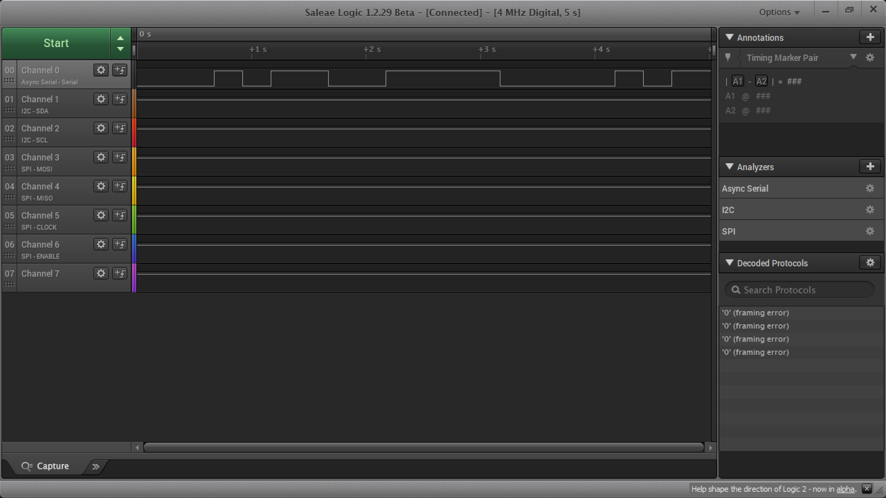
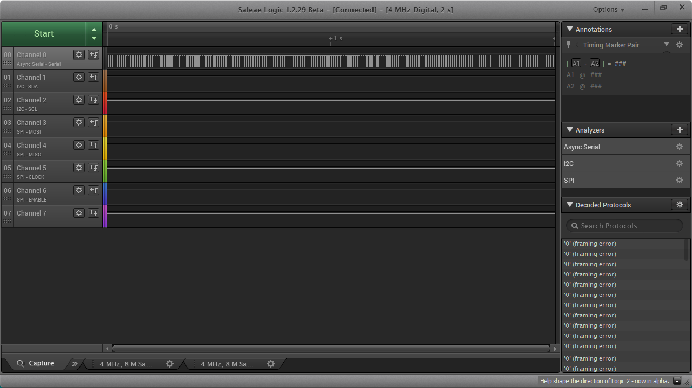
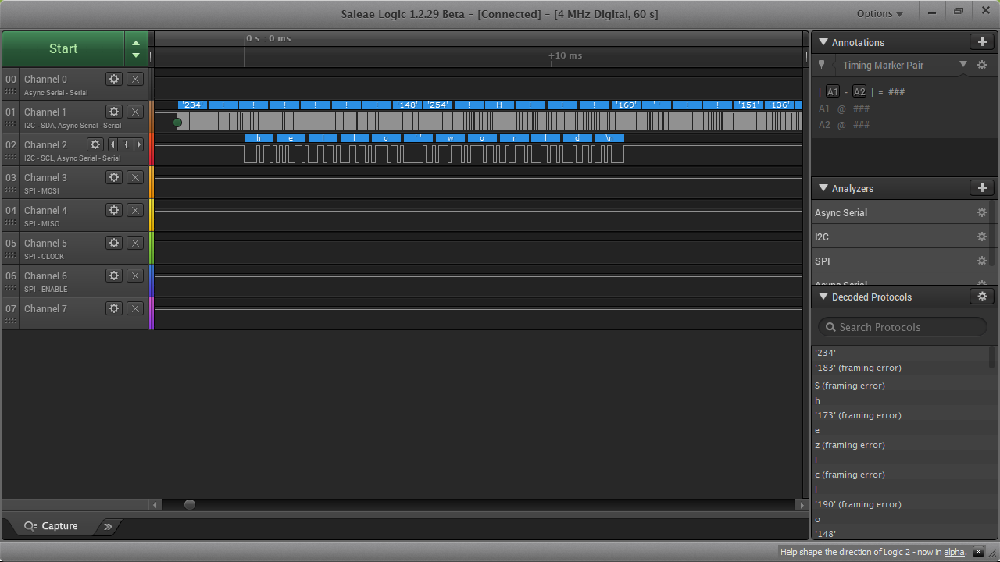
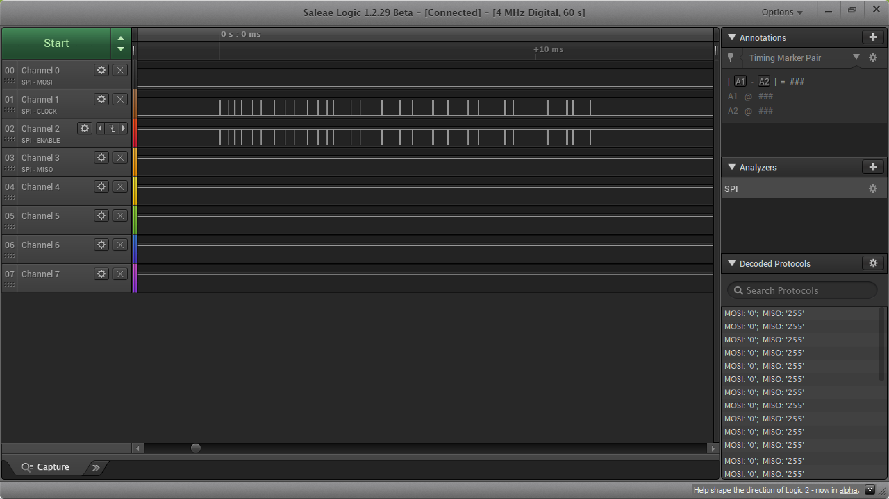

Name: Codey Sun

EID: lcs2672

Team Number: F13

## Questions

1. Why does your program need a setup and a loop?

    Setup initializes the pin, which only needs to be done once. The rest of the code then loops.

2. What is the downside to putting all your code in a loop?

    Unnecessary steps in a loop will make the code run slower.

3. Why does your code need to be compiled?

    Transform your source code into object code/machine code

4. When lowering the frequency in procedure A, step 4, what is going wrong? Brainstorm some solutions. Dimmers exist in the real world. What is their solution?

    Lower frequencies cause the light to blink rather than dim. We can fix this by lowering the voltage or increasing the resistance rather than changing the current.

5. Why do you need to connect the logic analyzer ground to the ESP32 ground?

    Current will not flow without a relative ground.

6. What is the difference between synchronous and asynchronous communication?

    Synchronous communication refers to the exchange of information in real time
	With asynchronous communication, data is exchanged but does not need to be responded to immediately

7. Profile of UART: Sent X bytes in Y time 

    12.434 ms

8. Profile of SPI: Sent X bytes in Y time

    11.73775 ms

9. Why is SPI so much faster than UART?

    Each direction of communication has it's own line

10. list one pro and one con of UART

    pro: simple to operate
	con: slower communication

11. list one pro and one con of SPI

    pro: faster communication 
    con: requires more wires

12. list one pro and one con of I2C

    pro: can support multiple slaves
	con: sensitive to interference

13. Why does I2C need external resistors to work?

    The lines are open drain so pull up or pull down resistors are needed.

## Screenshots

Procedure A, step 1:

Procedure A, step 4:

Procedure B, UART:

Procedure B, SPI:

